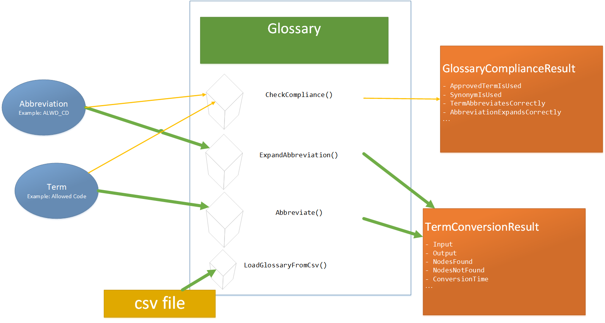

# Abbrevation Glossary

A .NET Standard 2.0 library that enables checking terms and abbreviations for compliance against a glossary. In addition, the glossary has methods to abbreviate terms or expand abbreviations based on the `GlossaryItems` in a `Glossary`. It was designed for checking data and database models, table names, and column names for compliance with a naming standards glossary.

## NuGet Package

This library is available as a compiled package is on Nuget.org

<https://www.nuget.org/packages/AbbreviationGlossary/>

## Architecture



## Classes / Objects

### [Glossary](src/AbbreviationGlossary/Glossary.cs)

A container for a colleciton `GlossaryItem` objects. The glossary provides methods to check a term's compliance by calling `CheckCompliance()` and passing a logical and physical name. It also has the conversion methods `ExpandAbbreviation()` and `ConvertToPhysical()`.

You can populate the glossary manually by calling the `AddGlossaryItem()` method. You can load a glossary from a csv file either locally `LoadCsvFileFromLocal()` or from a URL `LoadCsvFileFromUrl()`. The CSV should have a header row with the following heading: `Term,Abbreviation,IsTermPreferred`.

### [GlossaryItem](src/AbbreviationGlossary/GlossaryItem.cs)

Represents one item in the glossary. It consists of:

| Property| Description|
|---|---|
| `Term` | A string that represents a spelled out word or phrase. Example: **Applesauce** or **Apple Sauce** or **Smushed Up Apples** |
| `Abbreviation` | A string that represents a shortened form of a word or phrase. Example: **APLSC**|
| `IsTermPreferred` | A boolean that represents of the `GlossaryItem` is the preferred term to be used when converting an abbreviation to a term. (*true*/*false* or *0*/*1*)|

You can have multiple `GlossaryItems` with terms that convert to the same abbreviation. Using the examples above, we can have three terms: **Applesauce**, **Apple Sauce**, and **Smushed Up Apples** that all abbreviate to **APLSC**. *However*, **APLSC** can only expand to one of those terms. This is determined by the `IsTermPreferred` property. Therefore, only one of these three `GlossaryItems` can have the `IsTermPreferred` set to `true`. Assuming we want **APLSC** to expand to **Applesauce**, then we would set `IsTermPreferred` to true for **Applesauce** `GlossaryItem`. The other two would be set to false.

There **cannot** be multiple preferred `GlossaryItems` for the same `Abbreviation`. For example, both **Applesauce** and **Apple Sauce** ***cannot*** be set to preferred.

### [GlossaryComplianceResult](src/AbbreviationGlossary/GlossaryComplianceResult.cs)

A `GlossaryComplianceResult` object is returned by calling the `CheckCompliance()` on a `Glossary`. It has various properties about the result of checking the logical and physical names against the glossary.

### [TermConverterConfig](src/AbbreviationGlossary/TermConverterConfig.cs)

This class has properties for configuring how a `Glossary` performs name conversions.

### [TermConversionResult](src/AbbreviationGlossary/TermConversionResult.cs)

A `TermConverterResult` is returned by calling `ExpandAbbreviation()` or `AbbreviateTerm()`. It provides the output of a conversion routine as well as the what nodes were and weren't found in the in the glossary.

## Example Usage

These examples can be found in the unit test project. 

### Name Conversion Example

```csharp
using AbbreviationGlossary;
namespace Examples
{
    public class Example1
    {
        public void ReadMeExample1()
        {
            Glossary g = new Glossary();
            g.TermConverterConfiguration.DelimeterForNotFound_Left = "<";
            g.TermConverterConfiguration.DelimeterForNotFound_Right = ">";

            g.AddGlossaryItem(new GlossaryItem("Person", "PRSN", true));
            g.AddGlossaryItem(new GlossaryItem("First Name", "FNM", true));

            TermConversionResult exapndResult1 = g.ExpandAbbreviation("PRSN_FNM");
            Console.WriteLine(exapndResult1.Output);
            //Person First Name

            TermConversionResult exapndResult2 = g.ExpandAbbreviation("PRSN_PRNT_FNM");
            Console.WriteLine(exapndResult2.Output);
            //Person <PRNT> First Name
        }
    }
}
```

### Compliance Check Example

```csharp
using AbbreviationGlossary;
namespace Examples
{
    public class Example2
    {
        public void ReadMeExample2()
        {
            Glossary g = new Glossary();
            g.AddGlossaryItem(new GlossaryItem("Person", "PRSN", true));
            g.AddGlossaryItem(new GlossaryItem("First Name", "FNM", true));

            string term = "Person First name";
            string abbreviation = "PRSN_FNM";

            GlossaryComplianceResult result = g.CheckCompliance(term, abbreviation);

            Console.WriteLine(result.PreferredTermIsUsed);
            //true

            Console.WriteLine(result.TermAbbreviatesCorrectly);
            //true

            Console.WriteLine(result.AbbreviationExpandsToTermCorrectly);
            //true
        }
    }
}
```
